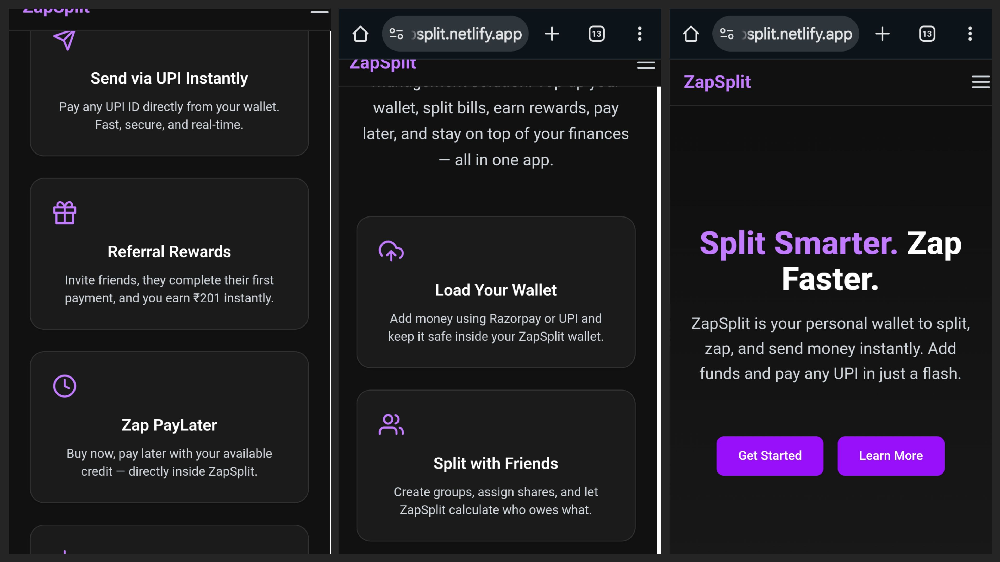
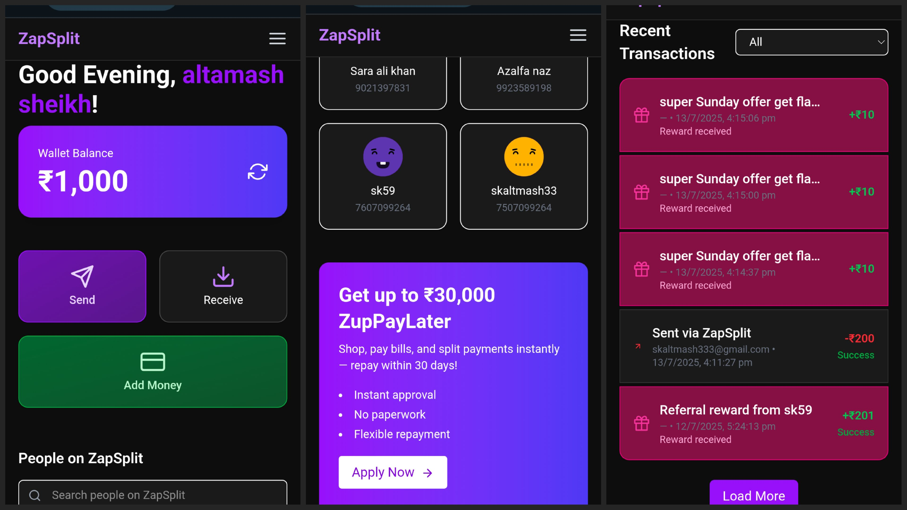
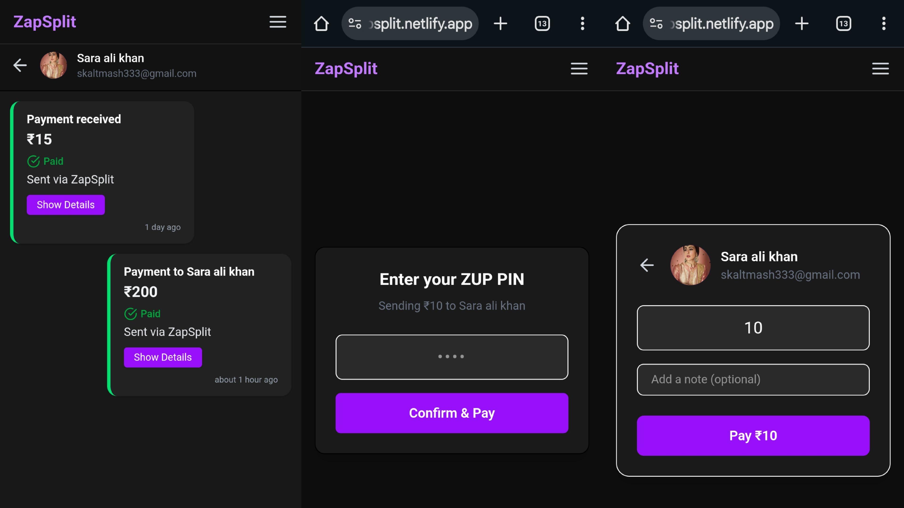
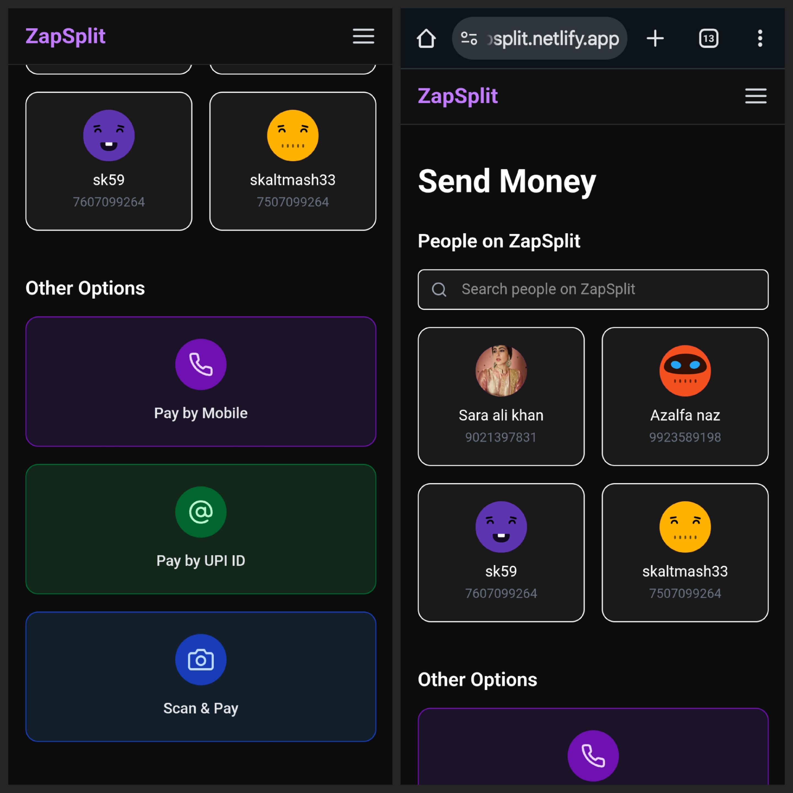
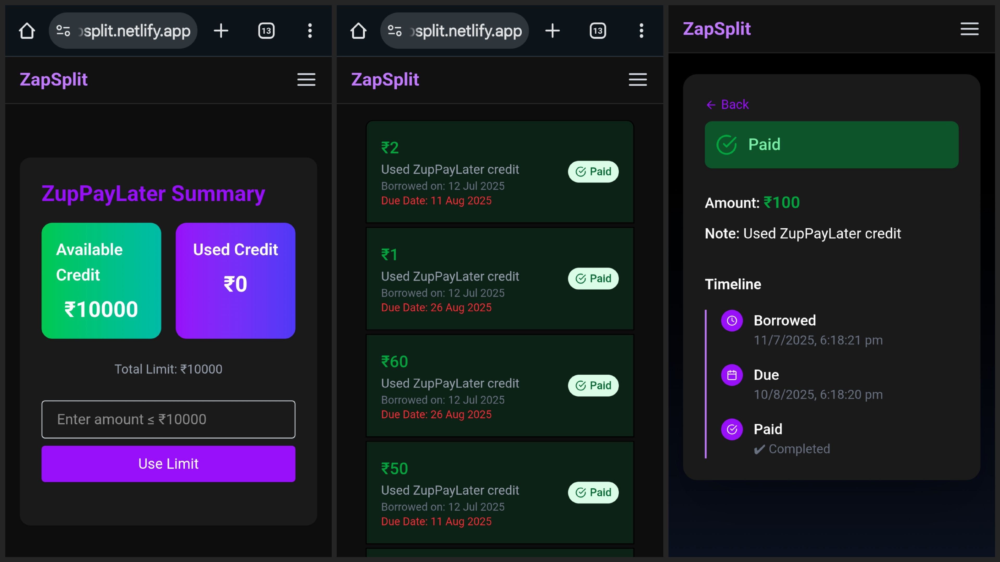
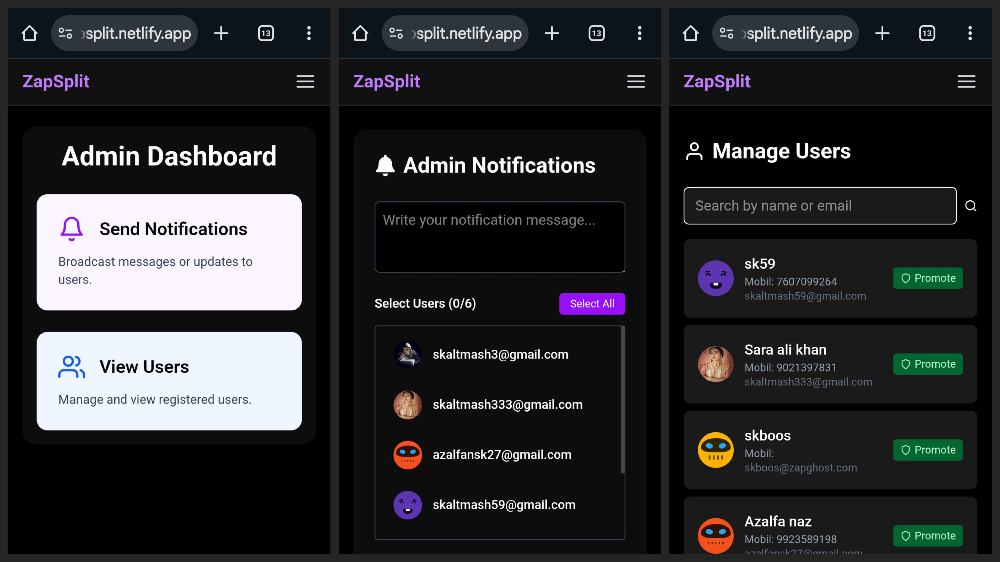

# ⚡ ZapSplit — Your Personal Wallet & Split-Pay Platform

**[🌐 Live Demo → zapsplit.netlify.app](https://zapsplit.netlify.app)**

ZapSplit is a modern web application that lets you **split expenses, send & receive money, manage PayLater credit, view analytics, and much more — all in one place.**  
It also features a **powerful Admin Dashboard** to manage users, notifications, and track platform activity.

---

## ✨ Features

### 👥 For Users
- 🔐 **User Authentication** — Login & Signup with Firebase
- 💰 **Wallet** — Add funds (via Razorpay), manage balance
- 🚀 **Send & Receive Money** — UPI-style transactions
- 📖 **Recent Transactions** — with filters, pagination, and skeleton loaders
- 📊 **Split Payments** — Split bills seamlessly with friends
- 🕒 **PayLater Credit** — Borrow now & repay later, track credit limit & usage
- 🔔 **Notifications** — Real-time updates from admin and system
- 🌙 **Dark Mode** — Beautiful, mobile-first dark UI

---

### 🛠️ Admin Dashboard
- 👤 **Manage Users** — View, edit, delete, and assign admin roles
- 🔔 **Send Notifications** — Selective or broadcast messages with HotToast
- 📝 **View User Details** — Full profile & transaction history
- 💳 **Update Wallet & Credit** — Adjust user balances & credit limits
- 📈 **Analytics Page** — Visualize platform metrics with React Chart
- 🌓 **Dark Mode Ready**

---

## 🧪 Tech Stack

| 🔧 Tool/Library             | 💡 Usage                          |
|-----------------------------|-----------------------------------|
| **React + Vite**            | Frontend SPA framework            |
| **Firebase Auth**           | User authentication               |
| **Firebase Firestore**      | Realtime database                 |
| **Cloudinary**              | Store & serve user profile images |
| **Razorpay**                | Add funds to wallet (test mode)   |
| **TailwindCSS**             | Styling with utility classes      |
| **React Icons**             | Beautiful iconography             |
| **React Hot Toast**         | User-friendly toast notifications |
| **React Router**            | Navigation & routing              |
| **React Chart.js / Recharts** | Analytics & charts             |
| **Lottie Animations**       | Fun UI animations (optional)      |
| **date-fns**                | Dates & relative time formatting  |

---
## 📷 Screenshots

✅ **Landing Page**  

✅ **User Dashboard**  

✅ **Payment Flow**  

✅ **Send Page**  

✅ **ZapPayLater**  

✅ **Admin Dashboard**  

